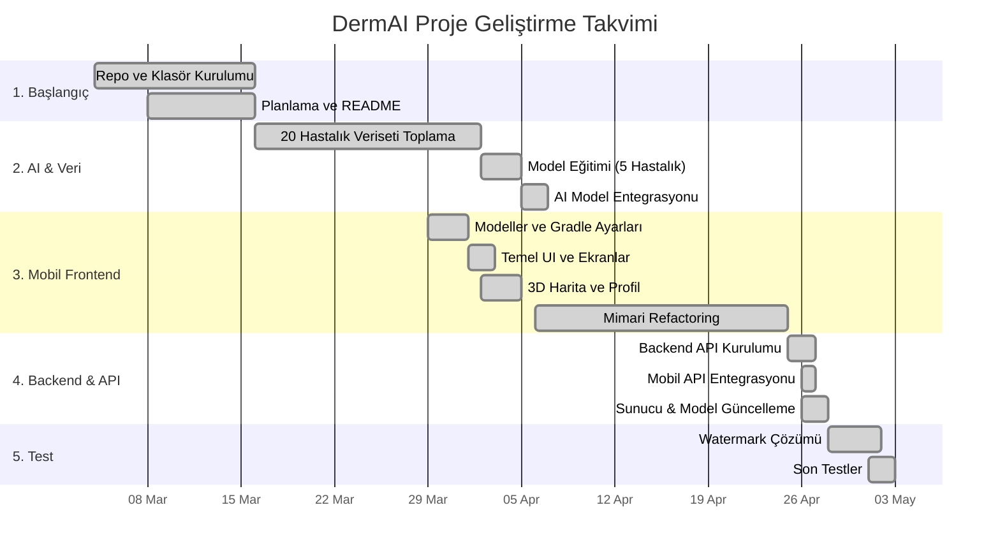

# DermAI Proje İş Zaman Çizelgesi
**Tarih Aralığı:** 4 Mart 2026 - 3 Mayıs 2026  
**Durum:** Başarıyla Tamamlandı / Yayına Hazır  
**Proje Kapsamı:** Mobil Uygulama (Kotlin/Jetpack Compose), Yapay Zeka Teşhis Modeli, Backend API

---

## 1. İş Kırılım Yapısı ve Zaman Çizelgesi Tablosu

Projenin 4 Mart'ta başlayan geliştirme süreci, tüm fazlarıyla aşağıdaki iş zaman çizelgesinde (WBS) profesyonel bir şekilde detaylandırılmıştır.

| Görev ID | Aşama ve Görev Adı | Başlangıç Tarihi | Bitiş Tarihi | Süre | Durum |
| :--- | :--- | :--- | :--- | :--- | :--- |
| **1.0** | **PROJE BAŞLANGICI VE KURULUM** | **04.03.2026** | **16.03.2026** | **13 Gün** | ✅ Tamamlandı |
| 1.1 | Proje repositorisinin (GitHub) oluşturulması | 04.03.2026 | 05.03.2026 | 2 Gün | ✅ Tamamlandı |
| 1.2 | Temel klasör yapısının (`ai`, `dataset`, `docs`) kurulumu | 05.03.2026 | 08.03.2026 | 4 Gün | ✅ Tamamlandı |
| 1.3 | Proje planlaması ve README dokümantasyonu | 08.03.2026 | 16.03.2026 | 9 Gün | ✅ Tamamlandı |
| | | | | | |
| **2.0** | **VERİ HAZIRLIĞI VE YAPAY ZEKA ALTYAPISI** | **16.03.2026** | **06.04.2026** | **22 Gün** | ✅ Tamamlandı |
| 2.1 | **20 Farklı Hastalık için Kapsamlı Veriseti Toplanması** | 16.03.2026 | 02.04.2026 | 18 Gün | ✅ Tamamlandı |
| 2.2 | Dermatoloji veritabanı JSON önerileri ve akademik referanslar | 16.03.2026 | 02.04.2026 | 18 Gün | ✅ Tamamlandı |
| 2.3 | **AI Model Eğitimi (5 Spesifik Hastalık + Normal Cilt için)** | 02.04.2026 | 05.04.2026 | 4 Gün | ✅ Tamamlandı |
| 2.4 | Eğitim ve test dosyalarının yüklenmesi, model doğrulama | 05.04.2026 | 06.04.2026 | 2 Gün | ✅ Tamamlandı |
| 2.5 | Yeni AI modelinin raporlama yetenekleriyle sisteme entegrasyonu | 06.04.2026 | 06.04.2026 | 1 Gün | ✅ Tamamlandı |
| | | | | | |
| **3.0** | **MOBİL UYGULAMA (FRONTEND) GELİŞTİRME** | **29.03.2026** | **25.04.2026** | **28 Gün** | ✅ Tamamlandı |
| 3.1 | Data modelleri, repository arayüzleri ve Gradle ayarları | 29.03.2026 | 01.04.2026 | 4 Gün | ✅ Tamamlandı |
| 3.2 | Mobil UI tasarımı ve temel ekranların inşası | 01.04.2026 | 02.04.2026 | 2 Gün | ✅ Tamamlandı |
| 3.3 | 3D Vücut Haritası ile lezyon bölgesi seçimi | 02.04.2026 | 05.04.2026 | 4 Gün | ✅ Tamamlandı |
| 3.4 | Kullanıcı Profil ekranı entegrasyonu | 04.04.2026 | 05.04.2026 | 2 Gün | ✅ Tamamlandı |
| 3.5 | Mobil mimari refactoring (Analiz akışı iyileştirmesi) | 06.04.2026 | 25.04.2026 | 20 Gün | ✅ Tamamlandı |
| | | | | | |
| **4.0** | **BACKEND VE SİSTEM ENTEGRASYONU** | **25.04.2026** | **28.04.2026** | **4 Gün** | ✅ Tamamlandı |
| 4.1 | Backend mimarisinin ve API servislerinin kurulması | 25.04.2026 | 26.04.2026 | 2 Gün | ✅ Tamamlandı |
| 4.2 | Mobil uygulamanın API (Backend) entegrasyonu | 26.04.2026 | 26.04.2026 | 1 Gün | ✅ Tamamlandı |
| 4.3 | Sunucu kurulumları ve `Server kurulum.txt` eklenmesi | 26.04.2026 | 26.04.2026 | 1 Gün | ✅ Tamamlandı |
| 4.4 | Model güncellemeleri ve backend optimizasyonu | 26.04.2026 | 28.04.2026 | 3 Gün | ✅ Tamamlandı |
| | | | | | |
| **5.0** | **TEST VE OPTİMİZASYON** | **28.04.2026** | **03.05.2026** | **6 Gün** | ✅ Tamamlandı |
| 5.1 | Filigran (Watermark) sorununun tespiti ve çözümü | 28.04.2026 | 01.05.2026 | 4 Gün | ✅ Tamamlandı |
| 5.2 | Genel hata giderme ve son testler (Canlıya hazırlık) | 01.05.2026 | 03.05.2026 | 3 Gün | ✅ Tamamlandı |

---

## 2. Görsel Proje Takvimi (Gantt Şeması)

## 3. Önemli Proje Metrikleri
* **Toplanan Veri Kapsamı:** Veri setimiz **20 farklı cilt hastalığını** barındıracak kadar geniştir.
* **Mevcut AI Teşhis Kapasitesi:** Optimum hız ve maksimum doğruluk sağlamak amacıyla, sistemimiz şu anda **5 spesifik hastalık ve normal cilt** durumunu analiz edecek şekilde konfigüre edilmiştir. Gelecek fazlarda bu sayı kademeli olarak 20'ye çıkartılacaktır.
